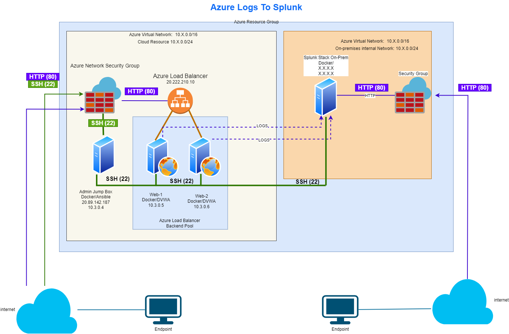

# dvwa_azure_lab

This project contains a proof-of-concept examining two scenarios using Microsoft Sentinel side-by-side with Splunk Enterprise for a Managed Security Service Provider MSSP log aggregation solution: 1) Resource, logging to Splunk from Azure Eventhub. 2) Resource logging to an Microsoft Sentinel, sending enriched Microsoft Sentinel alerts to 3rd party SIEM (Splunk. Using both the Damn Vulnerable Web Application (DVWA) and a Kali Linux, we are able to emulate malicious traffic originating from a threat, external to the internal network resources.


## Scenario One: On Premises resource -> Splunk



## Index
- [Ansible](#ansible)
- [Docker](#docker)
- [Azure](#azure)
- 
## Ansible

More times than not I have observed organizations struggle with config management and it is key for concise mitigation and remediation plan. In this series of blog posts which will hopefully walk you through a simple deployment of Ansible all the way to the most complex use-cases I have seen. I will first be covering how Ansible can be leverage to manage a Splunk deployment . Phase Two work will will cover how this can be done in a larger scale with Azure utilizing dynamically changing inventory of hosts for deployments which need to scale in a cloud environment. Finally, Phase Three will cover how to manage a enterprise deployment of Splunk with multi-tenecy requirements where there are various “customers” or business units with different Splunk config needs. The idea is to embark the necessary knowledge to not only deploy Splunk but anything else using Ansible as our configuration management system.

### Why Use Ansible
There are a few config management system. Many configuration management solutions exist (e.g., [Ansible](https://www.ansible.com), [Chef](https://www.chef.io/), [Vagrant](https://www.vagrantup.com/)). Ansible meets the requirements needed for deploying Splunk, among other security tools:

  - **No Agent Required** – This is awesome! Personally, I think the less agents a system has the less moving parts it has and the smaller your exploit landscape is. Ansible also has the ability to deploy an agent specially on a scenario where the client endpoint pulls configs instead of a master server pushing them.
  - **Uses SSH as Transport** – No need to deal with custom communication protocols, everything is encrypted natively. Keys are used instead of passwords. SSH is ubiquitous across the varied linux distributions. More often than not clients are already talking to servers via SSH.
  - **Moderate Learning Curve** – I found that the learning curve in Ansible is tremendously flatter than other configuration management frameworks. This is primarily due to the fact that play books read easily. Playbooks are YAML base and the project has thorough [documentation](https://docs.ansible.com/)
  - **Low overhead and scales to huge deployments** – There is no need to run a dedicated Ansible master server; the application has very low resource requirements. Ansible is also shown to scale. Check out how N
  - **Python Base** – Do not like something, want to integrate with something else? Ansible is python based and very easily extendable.

### Ansible Structure


  - **ansible-playbook:** Ansible executable which runs the playbooks etc..
  - **hosts:** INI file which contains the role/group and host mapping
  - playbooks: Ties in Roles, host groups and task together to create orchestrated actions on target hosts
  - **roles:** contains the actions each group will complete (this is where the deployment logic lives).

### Roles
Lets walk through the structure of a role. I will start with the common role. The common role should be ran no matter what kind of role the host has as it performs common functions that you would want on every host. If we look at the main.yml under tasks for this role we can see all the tasks it performs.

```bash
cat roles/common/tasks/main.yml
```

```YAML
---
# This playbook contains common tasks in this role
- include: apt.yml
- include: users.yml
- include: files.yml
- include: cron.yml
- include: time.yml
```

```bash
cat roles/common/tasks/apt.yml
```

```YAML
---
# This playbook install the apps required in a server
- name: install security controls
tags:
- configuration
- security
apt: name={{ item }} state=present
with_items:
- chkrootkit
- clamav
- name: install basic utilities
tags:
- system applications
apt: name={{ item }} state=present
with_items:
- vim
- net-tools
- yum-utils
- wget
- htop
```

The description of this is at the top as a comment. Using the “apt” Ansible module (follow the link for information on modules) we install a variety of software on the server. The first batch of software is tagged as “configuration” and “security” and the last are just configurations. The first batch install chkrootkit, clamav, and the second stanza installs a set of configuration utilities (vim, net-tools, yum-utils, wget, and htop. This is the typical structure of an Ansible play, which coordinates what happens on the host system. Plays are powered by different kinds of Ansible modules, the one used above is apt module. A full list of supported modules is available in the Ansible [Docs](https://docs.ansible.com/).

### Running Ansible for the First Time
  - Ansible is installed, see above
  - Generate keys for `splunk-admin` using `ssh-keygen`
  - Copy keys to the Splunk server 
```bash 
ssh-copy-id -i ~/.ssh/<key>.pub 
```
  - Inventory is configured under hosts file

## Docker
```Note:
TODO: Docker section
```

## Azure
```Note:
TODO: Azure section
```